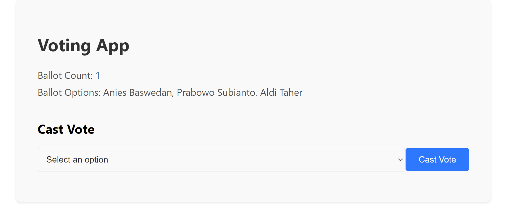

# Web3 Voting Simple Project

The Voting App is a decentralized application (DApp) built using React and Ethereum blockchain technology. It allows users to participate in voting on various ballots. The app provides the following features:

1. Ballot Creation: The app allows the contract owner to create a new ballot, specifying the name and options for voters to choose from.

2. Ballot Information: Users can view the total number of available ballots and the options for each ballot.

3. Casting Votes: Users can select an option from the available choices and cast their votes on the selected ballot. Once a vote is cast, the app updates the ballot's vote count.

4. Interactive User Interface: The app has an interactive user interface where users can select options from a dropdown menu and click a button to cast their vote.

5. Error Handling: The app provides error handling to ensure that users cannot cast a vote without selecting an option. It displays an error message if the user attempts to vote without selecting an option.

6. Real-Time Updates: The app dynamically updates the ballot count and vote counts in real-time, allowing users to see the latest voting results.

7. Closing Ballots: The contract owner has the ability to close a ballot, preventing further votes from being cast.

8. Feedback Messages: The app provides informative messages to users, such as success messages after casting a vote or error messages in case of any issues.

## NOTES : 
THE PROJECT IS INCOMPLETE, THE REMAINING FUNCTIONALITY WILL BE FURTHER INSERTED  

## Available Scripts

In the project directory, you can run:

### Git clone the repository

### `npm install`

Installs the dependencies from package.json

### `npm start`

Starts the App
